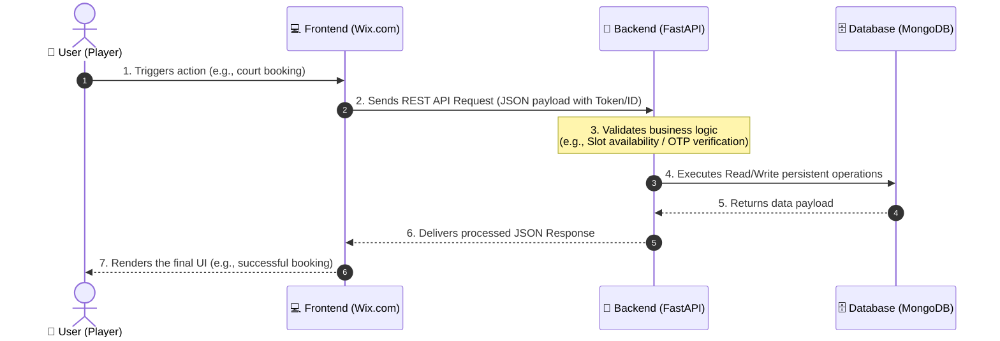

# 🧭 Comprehensive Integration Guide: Frontend (Wix) & Backend (FastAPI)

This document ensures that the project team and stakeholders share a unified understanding of the data flow and relationship between the frontend (Wix.com) and the backend (Python FastAPI).

---

## 🏗️ 1. Decoupled Architecture

The system utilizes a strictly decoupled design to optimize flexibility, performance, and data security. The frontend and backend communicate exclusively through REST APIs:

---

## 👥 2. Separation of Concerns

Clear boundaries prevent overlap and confusion between the frontend team (Wix.com) and the backend team (Us):

| Frontend (Wix.com) | Backend (Python FastAPI) |
| :--- | :--- |
| **Core Duty:** UI/UX presentation and client-side interactions | **Core Duty:** Business logic enforcement, security, and database state |
| 🎨 Designs buttons, forms, and pages using the Wix Editor | ⚙️ Engineers API endpoints matching the agreed API Contract |
| 🛡️ Manages phone number inputs and OTP entry forms | 🔑 Temporarily caches OTPs and processes verification checks |
| 📁 Provides the UI upload component for bank transfer slips | 💾 Processes slip image uploads to Cloud Storage and logs transactions |
| 📞 Implements Wix Velo (`wix-fetch`) to route data to the backend | 🗄️ Manages connection and transactions with the database engine |

---

## 📅 3. Phased Implementation Timeline (Prioritized)

To launch the project as efficiently as possible, we have split the features into two distinct phases. **We are prioritizing the court booking system so players can book courts immediately.**

### 🏆 Phase 1: Core Court Booking MVP (Current Priority)
*   **User Phone Verification:** SMS OTP verification flow to verify player identity and prevent spam bookings.
*   **Court Directory & Status:** Fetch court directory and show real-time slot availability.
*   **Booking Creation:** Allow users to book specific court slots (`POST /api/v1/queues/book`).
*   **Manual Slip Upload Payment:** Allow players to upload bank transfer slip images to pay for bookings, updating status to `pending_verification`.

### 🥈 Phase 2: Social Matchmaking & Advanced Features (Next Step)
*   **Google OAuth SSO:** Social sign-in integration to establish global player profiles.
*   **NTRP Matchmaking Algorithm:** Matchmaking system based on tennis ratings (NTRP 1.5 - 7.0) to open public matches and search compatible partners.
*   **Post-Match User Reviews (UGC Loop):** Submitting ratings and comments for match partners to maintain community standard.
*   **Auto Slip Verification:** Banking OCR/API integration to automatically scan QR codes on slips and approve bookings instantly.

---

## ⚡ 4. Backend Current State

> [!NOTE]
> The backend is fully ready for integration testing with the Wix team! We implemented a structured Mock Data Layer. When the frontend transmits an API request, our system automatically responds with valid, realistic mock data.

### 📡 Active API Endpoints for Wix Integration

#### 🔐 Authentication & Verification System (Phase 1 & 2)
*   `POST /api/v1/auth/login` (Standard Email/Password authentication)
*   `POST /api/v1/auth/google` (Google SSO authentication - *Phase 2*)
*   `POST /api/v1/auth/otp/send` (Triggers SMS gateway OTP generation - *Phase 1*)
*   `POST /api/v1/auth/otp/verify` (Validates OTP to confirm and unlock phone number - *Phase 1*)

#### 📅 Queue & Booking System (Phase 1)
*   `GET /api/v1/queues` (Fetches user-specific bookings, or all bookings for Admin)
*   `POST /api/v1/queues/book` (Creates a court booking with specific time slots)

#### 🤝 NTRP Matchmaking System (Phase 2)
*   `POST /api/v1/matching/find` (Searches compatible players and posts a match)

#### 💬 Post-Match User Reviews (UGC Loop - Phase 2)
*   `POST /api/v1/matches/{id}/reviews` (Submits a 1-5 star rating and comment for an opponent)

#### 💳 Payments System (Phase 1)
*   `POST /api/v1/payments/pay` (Uploads bank transfer slip images for payment)

---

## 🛠5. Future Steps to Go Live

Once API integration tests with Wix are complete, transitioning to the production environment requires:
1.  **MongoDB Production Connection:** Swap the mock data layer with production MongoDB credentials once provided.
2.  **Google SSO Credentials:** Configure production credentials via the Google Cloud Console (*Phase 2*).
3.  **SMS Gateway Credentials:** Link actual API keys with a Thailand-based SMS gateway for real OTP distribution (*Phase 1*).
4.  **Auto Slip Verification:** Integrate a banking OCR/API to scan slip QR codes for automated court booking approvals (*Phase 1*).