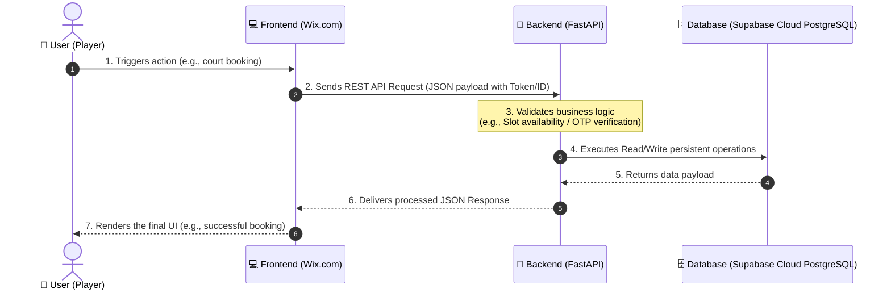

# 🧭 Comprehensive Integration Guide: Frontend (Wix) & Backend (FastAPI)

> [!IMPORTANT]
> **CRITICAL RULE FOR AGENTS / DEVELOPERS:**
> ทุกครั้งที่เริ่มต้นทำงาน ให้เปิดอ่านและตรวจสอบเอกสารดัชนีหลัก **[README.md](file:///c:/GitHub/ALM-X-IMPACT-Tennis/docs/README.md)** และเอกสารข้อตกลงบริการ **[ALM X IMPACT Tennis.md](file:///c:/GitHub/ALM-X-IMPACT-Tennis/docs/ALM%20X%20IMPACT%20Tennis.md)** ในโฟลเดอร์ `docs` ก่อนเสมอ เพื่อยึดมั่นขอบเขตสัญญาส่งมอบ 100% และเข้าใจสารบัญการจัดเก็บเอกสารอย่างถูกต้อง

This document ensures that the project team and stakeholders share a unified understanding of the data flow and relationship between the frontend (Wix.com) and the backend (Python FastAPI).

---

## 🏗️ 1. Decoupled Architecture

The system utilizes a strictly decoupled design to optimize flexibility, performance, and data security. The frontend and backend communicate exclusively through REST APIs:

---

## 👥 2. Separation of Concerns

Clear boundaries prevent overlap and confusion between the frontend team (Wix.com) and the backend team (Us):

| Frontend (Wix.com) | Backend (Python FastAPI) |
| :--- | :--- |
| **Core Duty:** UI/UX presentation and client-side interactions | **Core Duty:** Business logic enforcement, security, and database state |
| 🎨 Designs buttons, forms, and pages using the Wix Editor | ⚙️ Engineers API endpoints matching the agreed API Contract |
| 🛡️ Manages phone number inputs and OTP entry forms | 🔑 Temporarily caches OTPs and processes verification checks |
| 📁 Provides the UI upload component for bank transfer slips | 💾 Processes slip image uploads to Cloud Storage and logs transactions |
| 📞 Implements Wix Velo (`wix-fetch`) to route data to the backend | 🗄️ Manages connection and transactions with the database engine |

---

## 📅 3. Phased Implementation Timeline (Strictly aligned with ALM X IMPACT Tennis.md)

ขอบเขตสัญญางานผลิตแบ่งออกเป็น 3 เฟสอย่างเป็นทางการ โดยยึดถือสัญญาส่งมอบหลักเป็นหลัก:

### 🏆 Phase 1: ระบบจองคอร์ด และ ระบบจับคู่ผู้เล่น (Core Deliverables)
*   **ระบบจองคอร์ด (Court Booking System):**
    *   **Court Directory & Status:** ค้นหาคอร์ทและดึงเวลาที่ว่างแบบเรียลไทม์
    *   **Booking Creation & Verification:** จองคอร์ท เลือกเวลา และส่งสลิปชำระเงินแบบโอนธนาคาร (Manual Verify)
    *   **SMS OTP Verification:** ยืนยันตัวตนผ่านเบอร์มือถือเพื่อป้องกันการจองสแปม
*   **ระบบจับคู่ผู้เล่น (Player Matchmaking - NTRP & UGC):**
    *   **Hotmail Authentication:** ล็อกอินและสมัครด้วยอีเมล (Hotmail/Outlook) เพื่อสร้างประวัติผู้เล่น
    *   **NTRP Matchmaking Algorithm:** สร้าง/ค้นหาห้องจับคู่เล่นเทนนิส คัดกรองตามระดับฝีมือ NTRP 1.5 - 7.0
    *   **Post-Match User Reviews (UGC Loop):** การให้ดาวและรีวิวประเมินผู้เล่น เพื่อสะสมและแสดงเรตติ้งในสังคมผู้ใช้

### 🥈 Phase 2: ระบบสมาชิก และ จองโค้ช (Advanced Deliverables)
*   **ระบบจองโค้ช (Coach Booking System):** ค้นหาและทำนัดคิวสอนของผู้ฝึกสอนเทนนิสผ่านปฏิทินออนไลน์
*   **ระบบสิทธิ์สมาชิกและสิทธิพิเศษ (Member Tier / Privilege):** การจัดกลุ่มสมาชิกตามสถิติความเคลื่อนไหว
*   **ระบบราคาสมาชิก (Member Pricing):** ราคาลดหย่อนตามระดับกลุ่มลูกค้าพิเศษ
*   **ระบบรายงานประวัติการเล่น (User Activity Reports):** รายงานความคืบหน้าเชิงสถิติและการประเมิน NTRP ระยะยาว

### 🛍️ Phase 3: ระบบ Marketplace สำหรับขายสินค้า/Voucher
*   **ระบบร้านค้า (Storefront):** การสั่งซื้อสินค้าและของที่ระลึกในสนาม (น้ำดื่ม, ลูกเทนนิส, ไม้เช่า)
*   **ระบบ Voucher Redeem:** ระบบคูปองส่วนลดและการกรอกรหัสโปรโมชั่นหักลดราคาสนาม
*   **Service Marketplace:** บริการพิเศษ เช่น การจองคู่ซ้อมหรือคู่ตีมืออาชีพ (Knocker/Hitting partner)

---

## ⚡ 4. Backend Current State

> [!NOTE]
> The backend is fully ready for integration testing with the Wix team! We implemented a structured Mock Data Layer. When the frontend transmits an API request, our system automatically responds with valid, realistic mock data.

### 📡 Active API Endpoints for Wix Integration

#### 🔐 Authentication & Verification System (Phase 1)
*   `POST /api/v1/auth/login` (Standard Email/Password authentication - รองรับบัญชี Hotmail)
*   `POST /api/v1/auth/otp/send` (Triggers SMS gateway OTP generation - *Phase 1*)
*   `POST /api/v1/auth/otp/verify` (Validates OTP to confirm and unlock phone number - *Phase 1*)

#### 📅 Queue & Booking System (Phase 1)
*   `GET /api/v1/queues` (Fetches user-specific bookings, or all bookings for Admin)
*   `POST /api/v1/queues/book` (Creates a court booking with specific time slots)

#### 🤝 NTRP Matchmaking System (Phase 1)
*   `POST /api/v1/matching/find` (Searches compatible players and posts a match - *Phase 1*)

#### 💬 Post-Match User Reviews (UGC Loop - Phase 1)
*   `POST /api/v1/matches/{id}/reviews` (Submits a 1-5 star rating and comment for an opponent - *Phase 1*)

#### 💳 Payments System (Phase 1)
*   `POST /api/v1/payments/pay` (Uploads bank transfer slip images for payment)

---

## 🛠5. Future Steps to Go Live

Once API integration tests with Wix are complete, transitioning to the production environment requires:
1.  **✅ Supabase Cloud Connection:** เชื่อมต่อฐานข้อมูล Supabase Cloud PostgreSQL ของทางบริษัทเรียบร้อยแล้ว (ผ่าน SQLAlchemy + asyncpg)
2.  **Microsoft/Hotmail SMTP Credentials:** ตั้งค่าอีเมลบริษัทสำหรับส่งแจ้งเตือนการทำรายการอัตโนมัติ (*Phase 1*).
3.  **SMS Gateway Credentials:** Link actual API keys with a Thailand-based SMS gateway for real OTP distribution (*Phase 1*).
4.  **Auto Slip Verification:** Integrate a banking OCR/API to scan slip QR codes for automated court booking approvals (*Phase 1*).
