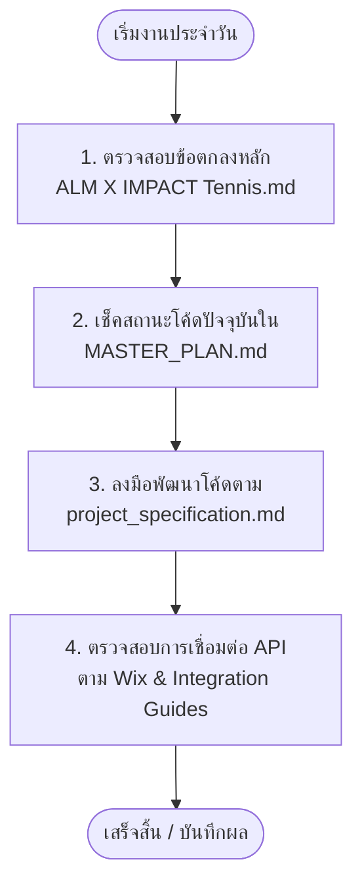

# 🎾 ALM-X-IMPACT Tennis — Documentation Index & Control Center
> **ศูนย์บัญชาการและดัชนีเอกสารสำหรับโครงการระบบจองสนามและหาคู่เล่นเทนนิส**  
> 👤 **ลูกค้า (Client):** คุณตุ๊ก | 💻 **ผู้พัฒนา (Developer):** พี่ไมค์

ยินดีต้อนรับสู่ศูนย์กลางการจัดเก็บเอกสารโครงการ **ALM-X-IMPACT Tennis** เพื่อป้องกันความสับสนและจัดระบบให้การพัฒนาเป็นไปอย่างราบรื่น เอกสารทั้งหมดถูกจัดหมวดหมู่ตามวัตถุประสงค์และกลุ่มผู้ใช้งานไว้ดังนี้ครับ:

---

## 🗂️ การจัดหมวดหมู่เอกสาร (Documentation Categories)

### 🤝 1. สัญญาและกรอบการทำงานหลัก (Business & SLA Agreements)
เอกสารที่เป็นต้นน้ำของโครงการ สำหรับใช้ยืนยันขอบเขตงานและกรอบเวลาการส่งมอบร่วมกันกับ **คุณตุ๊ก (ลูกค้า)**
*   📄 **[ALM X IMPACT Tennis.md](file:///c:/GitHub/ALM-X-IMPACT-Tennis/docs/ALM%20X%20IMPACT%20Tennis.md)**  
    *   *วัตถุประสงค์:* แผนกรอบเวลา 30 วัน, ขอบเขตงาน 3 เฟสอย่างเป็นทางการ และ 7 กฎเหล็กในการประสานงาน (SLA) **(เอกสารอ้างอิงสูงสุดของโครงการ)**

---

### 📐 2. ข้อกำหนดทางเทคนิค (Technical Specifications & Contracts)
พิมพ์เขียวสำหรับระบบหลังบ้าน (FastAPI + Supabase Cloud PostgreSQL) ที่พี่ไมค์ใช้สำหรับออกแบบระบบและการสื่อสาร
*   📄 **[project_specification.md](file:///c:/GitHub/ALM-X-IMPACT-Tennis/docs/project_specification.md)**  
    *   *วัตถุประสงค์:* รายละเอียดเวอร์ชัน Tech Stack, โครงสร้างตารางใน Supabase Cloud PostgreSQL และข้อตกลง Schema (API Contract) สำหรับการเชื่อมต่อระหว่างหน้าบ้านและหลังบ้าน

---

### 📈 3. แผนการพัฒนาและติดตามผล (Execution & Master Tracking)
เอกสารสำหรับให้พี่ไมค์ใช้บันทึกและตรวจสอบสถานะความคืบหน้าของฟีเจอร์จริงในโค้ด
*   📄 **[MASTER_PLAN.md](file:///c:/GitHub/ALM-X-IMPACT-Tennis/docs/MASTER_PLAN.md)**  
    *   *วัตถุประสงค์:* สถานะงานรายจุดแบบละเอียด แยกตามระดับความเสถียร (✅ เสร็จจริง / 🟡 โครงสร้าง Mock / ❌ ยังไม่ทำ)
*   📄 **[core feature.md](file:///c:/GitHub/ALM-X-IMPACT-Tennis/docs/core%20feature.md)**  
    *   *วัตถุประสงค์:* สรุปฟังก์ชันหลักในขอบเขต MVP และ User Flow ตั้งแต่สมัครสมาชิกจนถึงจุดสิ้นสุดการรีวิวหลังเกม (UGC)

---

### 🔗 4. คู่มือการเชื่อมต่อระบบ (Integration & Operations Guides)
เอกสารคู่มือสำหรับพี่ไมค์และทีมพัฒนาฝั่งหน้าบ้าน (Wix.com) เพื่อใช้ทำงานร่วมกัน
*   📄 **[WIX_VELO_BOOKING_GUIDE.md](file:///c:/GitHub/ALM-X-IMPACT-Tennis/docs/WIX_VELO_BOOKING_GUIDE.md)**  
    *   *วัตถุประสงค์:* คู่มือสำหรับผู้พัฒนาฝั่ง Wix ในการเขียนโค้ด Velo เพื่อเชื่อมต่อ API มายังหลังบ้านอย่างปลอดภัย
*   📄 **[integration_and_operations.md](file:///c:/GitHub/ALM-X-IMPACT-Tennis/docs/integration_and_operations.md)**  
    *   *วัตถุประสงค์:* คู่มือการตั้งค่า SMS Gateway (ThaiBulkSMS OTP), วิธีตั้งค่า `.env` และการอ่านระบบ Log การทำงานหลังบ้าน

---

## 🧭 ลำดับขั้นตอนการเริ่มงานและตรวจสอบเอกสาร (Mike's Cheat Sheet)

เมื่อพี่ไมค์หรือผู้พัฒนา AI เริ่มงานในแต่ละวัน ให้ทำตามขั้นตอนการตรวจสอบดังนี้:

---
> 💡 *คำแนะนำ:* หากมีการเปลี่ยนแปลงหรือตกลงใดๆ เพิ่มเติมกับคุณตุ๊ก ขอให้พี่ไมค์บันทึกไว้ใน `ALM X IMPACT Tennis.md` ก่อนทุกครั้ง เพื่อรักษาฐานข้อมูลความจริงจุดเดียวร่วมกันครับ!
