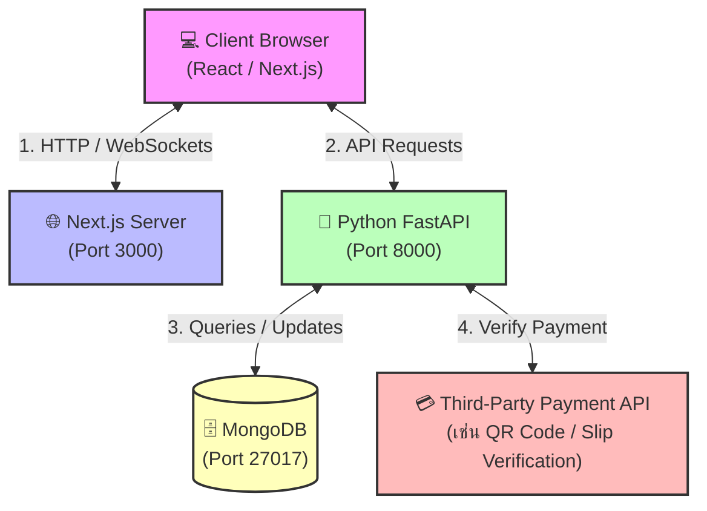

# 📑 Project Specification Template (เอกสารกลางสำหรับข้อตกลงโครงการ)

เอกสารฉบับนี้ใช้เป็น **"เอกสารกลาง"** เพื่อบันทึกข้อตกลงร่วมกันระหว่างทีมพัฒนาในการออกแบบระบบและสถาปัตยกรรมของโครงการ **ALM-X-IMPACT Tennis** เพื่อใช้ตรวจสอบความถูกต้องและลดความสับสนในการทำงานร่วมกัน

---

## 🛠️ หัวข้อที่ 1: Tech Stack Selection (การเลือกเทคโนโลยี)

ตารางสรุปเทคโนโลยีพื้นฐานและข้อกำหนดเวอร์ชันสำหรับโครงการ **ALM-X-IMPACT Tennis** (ปรับปรุงให้ตรงกับสภาพแวดล้อมจริงในเครื่องพัฒนาของท่าน)

### 💻 1. Frontend Integration (Wix.com)
ทีมพัฒนาฝั่งหน้าบ้านเปลี่ยนมาใช้งานระบบ **Wix.com** โดยทำการเชื่อมต่อกับระบบหลังบ้านผ่านทาง REST API เพื่อประมวลผลข้อมูลและใช้บริการต่าง ๆ เช่น ระบบสมาชิก การจองคิวสนาม และการหาคู่เล่น

---

### 🐍 2. Backend Tech Stack & Versions
ทีมพัฒนาฝั่งหลังบ้านจะใช้ภาษา Python ร่วมกับ FastAPI และเครื่องมือช่วยจัดการฐานข้อมูล/ความปลอดภัย ดังนี้:

*   **Language Runtime:** Python `v3.11.9` *(ตรงตามเวอร์ชันในเครื่องของท่าน)*
*   **Web Framework:** FastAPI `v0.115.6` *(เวอร์ชันเสถียรล่าสุด รองรับ Asynchronous และสร้างคู่มือ Swagger Docs ให้อัตโนมัติ)*
*   **ASGI Server:** Uvicorn `v0.34.0` *(เวอร์ชันล่าสุดสำหรับรัน Web Server ประสิทธิภาพสูง)*
*   **Database ODM (Async):** Beanie `v1.27.0` *(ไลบรารี Object Document Mapper สำหรับ MongoDB ทำงานร่วมกับ Pydantic v2 แบบ Async อย่างเสถียร)*
*   **Database Driver:** Motor `v3.6.0` *(Async MongoDB Driver สำหรับ Python เวอร์ชันล่าสุด)*
*   **Data Validation:** Pydantic `v2.10.3` *(เวอร์ชันล่าสุด ปลอดภัย และทำงานเร็วกว่า Pydantic v1 ถึง 10 เท่า)*
*   **Auth & JWT:** PyJWT `v2.10.1` *(สร้างและตรวจสอบ JWT Token เวอร์ชันอัปเดตล่าสุด)*
*   **Security & Password Hashing:** `pwdlib[bcrypt] v0.2.1` *(🔥 ใช้แทน passlib เพื่อตัดปัญหาการชนกันกับ bcrypt บน Python 3.11+ อย่างถาวร)*
*   **File Upload Support:** python-multipart `v0.0.19` *(จำเป็นสำหรับการรับอัปโหลดภาพสลิปชำระเงินโอนเงิน)*
*   **Environment Management:** python-dotenv `v1.0.1` *(โหลดตัวแปรคอนฟิกจากไฟล์ `.env`)*

---

### 🗄️ 3. Database & Tools
*   **Database Engine:** MongoDB Community Server `v7.0.9` (ฐานข้อมูล NoSQL แบบ Document เพื่อรองรับ Schema ที่ยืดหยุ่นสูง)
*   **GUI Client:** MongoDB Compass `v1.43.0` (สำหรับช่วยตรวจสอบข้อมูลในฐานข้อมูลผ่านหน้าต่างโปรแกรม)

---

### ⚠️ 4. ข้อควรระวังและการป้องกันบั๊ก/เออเรอร์ข้ามเวอร์ชัน (Breaking Changes & Error Prevention)

เพื่อป้องกันการเกิดเออเรอร์ระหว่างรันโปรแกรม เนื่องจากฟีเจอร์เวอร์ชันล่าสุดของ Next.js 15 และ Python 3.11 มีการเปลี่ยนแปลงที่สำคัญ (Breaking Changes) ขอให้สมาชิกในทีมปฏิบัติตามแนวทางแก้ไขเหล่านี้:

> [!IMPORTANT]
> **1. Next.js 15: dynamic route `params` & `headers` เปลี่ยนเป็น Asynchronous**
> ใน Next.js 15 ค่าของ `params`, `searchParams` รวมถึงฟังก์ชัน `cookies()` และ `headers()` **ต้องใช้ `await` เสมอ** การเรียกใช้แบบ Synchronous แบบเดิมจะทำให้เกิด Build Error ทันที!
> *   *แบบเก่า (เกิดเออเรอร์ใน Next 15):*
>     ```typescript
>     export default function Page({ params }: { params: { id: string } }) {
>       return <div>ID: {params.id}</div>;
>     }
>     ```
> *   *แบบใหม่ที่ถูกต้อง:*
>     ```typescript
>     export default async function Page({ params }: { params: Promise<{ id: string }> }) {
>       const { id } = await params;
>       return <div>ID: {id}</div>;
>     }
>     ```

> [!WARNING]
> **2. Python 3.11+: ปัญหา bcrypt ใน passlib (แนะนำใช้ pwdlib)**
> ไลบรารี `passlib` เดิมไม่มีการอัปเดตมานาน เมื่อนำมารันร่วมกับไลบรารี `bcrypt` เวอร์ชันใหม่บน Python 3.11+ จะเกิดเออเรอร์ `TypeError: 'NoneType' object is not callable` หรือ `AttributeError` ตอนรันคำสั่งแฮชรหัสผ่าน
> *   **ทางเลือกที่ถูกต้อง:** FastAPI ยุคปัจจุบันเปลี่ยนคำแนะนำอย่างเป็นทางการมาให้ใช้ **`pwdlib[bcrypt]`** ร่วมกับไลบรารี `bcrypt` โดยตรง ซึ่งเสถียรและทำงานร่วมกับ Python 3.11/3.12 ได้แบบ 100% ปราศจากข้อผิดพลาด

> [!TIP]
> **3. React 19 Peer Dependency ในการลงไลบรารีหน้าบ้าน**
> เนื่องจาก Next.js 15 บังคับใช้ React 19 ซึ่งเพิ่งปล่อยตัวเต็ม ทำให้ไลบรารีเก่าบางตัวอาจไม่มีการประกาศว่าซัพพอร์ต React 19 ใน metadata ส่งผลให้ตอนพิมพ์ `npm install` อาจเกิดเออเรอร์บล็อกการติดตั้ง (Peer Dependency Conflict)
> *   **วิธีแก้ไข:** หากลงไลบรารีทั่วไปแล้วติดปัญหา ให้ระบุแฟล็ก `--legacy-peer-deps` เพื่ออนุญาตให้ติดตั้งและทำงานร่วมกันได้ เช่น:
>     ```bash
>     npm install <package-name> --legacy-peer-deps
>     ```

---

## 📊 หัวข้อที่ 2: System Architecture Diagram (แผนผังระบบ)

แผนผังแสดงสถาปัตยกรรมของระบบและการไหลของข้อมูล (Data Flow) พร้อมทั้งกำหนด Port ในการพัฒนาบนเครื่อง Local Machine

### 💻 Local Development Ports
*   **Frontend (Next.js):** `http://localhost:3000`
*   **Backend (Python/FastAPI):** `http://localhost:8000`
*   **Database (MongoDB):** `mongodb://localhost:27017`

### 🔄 Data Flow & System Diagram


---

## 🌿 หัวข้อที่ 3: Git Workflow & Repository Structure

ข้อตกลงร่วมกันในการบริหารจัดการซอร์สโค้ดผ่านระบบ Git บน GitHub Organization

### 📁 1. Repository Strategy: Mono-Repo
โครงการนี้ใช้โครงสร้างแบบ **Mono-Repo** (รวมโฟลเดอร์ไว้ใน Repository เดียวกัน) เพื่อความสะดวกในการจัดการเวอร์ชันและการประสานงาน

```text
ALM-X-IMPACT-Tennis/ (Root)
├── docs/                 # เอกสารกลางและข้อกำหนดต่าง ๆ (เช่น project_specification.md)
├── frontend/             # ซอร์สโค้ดส่วนหน้าบ้าน (Next.js)
├── backend/              # ซอร์สโค้ดส่วนหลังบ้าน (Python FastAPI)
└── database/             # สคริปต์การตั้งค่า Schema, Seed Data หรือ Migration
```

### 🎋 2. Branch Naming Convention (กฎการตั้งชื่อกิ่ง)
เพื่อรักษาระเบียบในการทำงานและการทำ CI/CD ให้กำหนดโครงสร้างชื่อ Branch ดังนี้:

*   `main` (หรือ `master`): กิ่งหลักสำหรับขึ้นโปรดักชัน (Production Only) ห้าม Push โค้ดตรง ๆ โดยเด็ดขาด
*   `develop`: กิ่งรวมงานสำหรับการทดสอบเบื้องต้น (Staging/Testing environment)
*   `feature/<ticket-id>-<description>`: กิ่งสำหรับการพัฒนาฟีเจอร์ใหม่
    *   *ตัวอย่าง:* `feature/booking-system`, `feature/user-login`
*   `bugfix/<ticket-id>-<description>`: กิ่งสำหรับแก้ไขบั๊กทั่วไปที่พบจากการทดสอบ
    *   *ตัวอย่าง:* `bugfix/fix-matching-timeout`
*   `hotfix/<description>`: กิ่งด่วนสำหรับแก้บั๊กเร่งด่วนบน Production
    *   *ตัวอย่าง:* `hotfix/payment-gateway-crash`

### ✍️ 3. Git Commit Message Guide (Conventional Commits)
แนะนำให้เขียน Commit Message ให้เข้าใจง่ายตามมาตรฐาน เช่น:
*   `feat: add queue booking page` (เพิ่มฟีเจอร์ใหม่)
*   `fix: resolve payment slip upload error` (แก้ไขข้อผิดพลาด)
*   `docs: update project specification template` (แก้ไขเอกสาร)

---

## 🗃️ หัวข้อที่ 4: Database Schema Rough Draft (ร่างตารางฐานข้อมูลคร่าวๆ)

ระบบจองคิวสนามเทนนิสและระบบจับคู่ใช้งาน **MongoDB** ซึ่งเป็นแบบ Document Schema ด้านล่างนี้คือแบบร่างโครงสร้างของคอลเลกชัน (Collections) หลักที่ปรับปรุงให้สอดรับกับฟีเจอร์ใน `core feature.md` แล้ว

### 👥 1. Users Collection
```json
{
  "_id": "ObjectId",
  "username": "string",
  "email": "string",
  "password_hash": "string", // ค่าว่างได้หากสมัครผ่าน Google Auth
  "google_id": "string", // เก็บ ID จาก Google SSO
  "role": "string", // "player", "admin", "court_owner"
  "profile": {
    "display_name": "string",
    "phone": "string",
    "is_phone_verified": "boolean", // สถานะการยืนยันตัวตนด้วย OTP
    "ntrp_rating": "number", // ระดับฝีมือเทนนิส 1.5 - 7.0 (NTRP)
    "wtn_rating": "number", // ระดับฝีมือเทนนิส 40 - 1 (WTN)
    "playing_style": "string", // "Aggressive Baseliner", "Serve & Volley", "All-Court"
    "match_preference": "string" // "equal" (เท่ากัน), "higher" (เก่งกว่า), "lower" (อ่อนกว่า), "any"
  },
  "created_at": "datetime"
}
```

### 🎾 2. Courts Collection (ข้อมูลสนามเทนนิส)
```json
{
  "_id": "ObjectId",
  "court_name": "string",
  "location": "string",
  "price_per_hour": "number",
  "available_slots": [
    { "time_slot": "17:00-18:00", "is_booked": false }
  ]
}
```

### 📅 3. Bookings/Queues Collection (ระบบจองคิวสนาม)
```json
{
  "_id": "ObjectId",
  "user_id": "ObjectId", // Reference to Users
  "court_id": "ObjectId", // Reference to Courts
  "booking_date": "string", // YYYY-MM-DD
  "time_slot": "string", // "18:00-19:00"
  "status": "string", // "pending", "confirmed", "cancelled"
  "payment_id": "ObjectId", // Reference to Transactions
  "created_at": "datetime"
}
```

### 🤝 4. Matches Collection (ระบบจับคู่เล่นเทนนิส)
```json
{
  "_id": "ObjectId",
  "host_user_id": "ObjectId", // ผู้สร้างโพสต์หาคู่เล่น
  "invited_user_ids": ["ObjectId"], // ผู้ที่เข้ามาร่วมเล่นด้วย (Array รองรับประเภทคู่)
  "court_id": "ObjectId",
  "match_date": "string", // YYYY-MM-DD
  "time_slot": "string", // "18:00-20:00"
  "match_type": "string", // "singles" (เดี่ยว) / "doubles" (คู่)
  "ntrp_min": "number", // เกณฑ์ฝีมือขั้นต่ำที่เปิดรับ (เช่น 3.0)
  "ntrp_max": "number", // เกณฑ์ฝีมือสูงสุดที่เปิดรับ (เช่น 4.5)
  "status": "string", // "open", "matched", "cancelled"
  "created_at": "datetime"
}
```

### 💬 5. Reviews Collection (ระบบรีวิวผู้เล่นและสนาม - UGC Content)
```json
{
  "_id": "ObjectId",
  "reviewer_id": "ObjectId", // ผู้เขียนรีวิว (Reference to Users)
  "reviewee_id": "ObjectId", // ผู้ที่ถูกรีวิว (Reference to Users - เพื่อนร่วมแมตช์)
  "match_id": "ObjectId", // รีวิวที่เกิดจากแมตช์การเล่นใด (Reference to Matches)
  "rating": "number", // คะแนนเรตติ้ง (1 - 5 ดาว)
  "comment": "string", // ความคิดเห็นเพิ่มเติม
  "created_at": "datetime"
}
```

### 💳 6. Transactions Collection (ระบบโอนเงิน/ชำระเงิน)
```json
{
  "_id": "ObjectId",
  "user_id": "ObjectId",
  "amount": "number",
  "payment_method": "string", // "PromptPay", "BankTransfer"
  "slip_url": "string", // ที่อยู่ไฟล์ภาพสลิปบน Cloud
  "status": "string", // "pending", "verified", "failed"
  "verified_at": "datetime"
}
```

### 🔗 ความสัมพันธ์เบื้องต้น (Relationships)
1.  **User กับ Booking (One-to-Many):** User 1 คน สามารถจองคิวสนามได้หลายครั้ง (`user_id` ในคอลเลกชัน Bookings)
2.  **User กับ Match (One-to-Many / Many-to-Many):** User 1 คนสามารถเป็น Host สร้าง Match ได้หลายอัน และเข้าร่วม Match ของคนอื่นได้หลายอัน
3.  **Booking กับ Transaction (One-to-One):** การจองคิว 1 รายการ จะสัมพันธ์กับการโอนชำระเงิน 1 รายการเสมอ
4.  **Match กับ Review (One-to-Many):** แมตช์ 1 แมตช์เมื่อสิ้นสุดการเล่นจะสามารถเกิดการรีวิวผู้เล่นที่ร่วมแมตช์ได้หลายรีวิว (UGC)

---

## 🔌 หัวข้อที่ 5: API Endpoints Contract (สัญญาข้อตกลง API)

สัญญาการเชื่อมต่อเพื่อประสิทธิภาพในการทำงานร่วมกันระหว่างหน้าบ้าน (Next.js) และหลังบ้าน (FastAPI) โดยเพิ่มการรองรับ Google Login, SMS OTP, และการส่งรีวิว UGC ตามโฟลว์จริง

### 🔐 1. Authentication (ระบบสมาชิกและความปลอดภัย)

#### `POST /api/v1/auth/login`
*   **คำอธิบาย:** สำหรับการเข้าสู่ระบบแบบเดิมด้วยอีเมล
*   **Request Body:**
    ```json
    {
      "email": "user@example.com",
      "password": "securepassword123"
    }
    ```

#### `POST /api/v1/auth/google`
*   **คำอธิบาย:** สำหรับการเข้าสู่ระบบด้วย Google Account (SSO)
*   **Request Body:**
    ```json
    {
      "id_token": "google_oauth_jwt_token_string"
    }
    ```
*   **Response (200 OK):**
    ```json
    {
      "access_token": "jwt_token_here",
      "token_type": "bearer",
      "user": {
        "id": "60d5ec4b2f8fb8123456789a",
        "username": "tennis_player_sso",
        "email": "user@gmail.com",
        "role": "player",
        "is_phone_verified": false
      }
    }
    ```

#### `POST /api/v1/auth/otp/send`
*   **คำอธิบาย:** ขอส่งรหัส OTP ยืนยันเบอร์โทรศัพท์มือถือผ่าน SMS
*   **Request Body:**
    ```json
    {
      "phone": "0812345678"
    }
    ```
*   **Response (200 OK):**
    ```json
    {
      "message": "OTP sent successfully to 0812345678",
      "ref_code": "XYZA"
    }
    ```

#### `POST /api/v1/auth/otp/verify`
*   **คำอธิบาย:** ยืนยันรหัส OTP จากโทรศัพท์มือถือเพื่อบันทึกสถานะในฐานข้อมูล
*   **Request Body:**
    ```json
    {
      "phone": "0812345678",
      "otp_code": "123456",
      "ref_code": "XYZA"
    }
    ```
*   **Response (200 OK):**
    ```json
    {
      "status": "success",
      "message": "Phone number verified successfully"
    }
    ```

---

### 📅 2. Queue & Booking (ระบบจองคิวสนาม)

#### `GET /api/v1/queues`
*   **คำอธิบาย:** ดึงรายการคิวการจองของตนเอง หรือรายการจองทั้งหมด (สำหรับ Admin)
*   **Response (200 OK):**
    ```json
    [
      {
        "booking_id": "60d5ec4b2f8fb8123456789b",
        "court_name": "Impact Court A",
        "booking_date": "2026-05-25",
        "time_slot": "18:00-20:00",
        "status": "confirmed"
      }
    ]
    ```

#### `POST /api/v1/queues/book`
*   **คำอธิบาย:** การส่งคำขอจองคิวสนาม
*   **Request Body:**
    ```json
    {
      "court_id": "60d5ec4b2f8fb8123456789c",
      "booking_date": "2026-05-25",
      "time_slot": "18:00-20:00"
    }
    ```
*   **Response (201 Created):**
    ```json
    {
      "message": "Booking request created successfully",
      "booking_id": "60d5ec4b2f8fb8123456789b",
      "status": "pending_payment"
    }
    ```

---

### 🤝 3. Matchmaking & Filtering (ระบบหาคู่เล่น/จับคู่ตามระดับความเก่ง)

#### `POST /api/v1/matching/find`
*   **คำอธิบาย:** ใช้ค้นหาผู้เล่นหรือเปิดโพสต์ห้องหาคู่เล่น โดยคัดกรองระดับ NTRP และสเปกความชอบโดยละเอียด
*   **Request Body:**
    ```json
    {
      "court_id": "60d5ec4b2f8fb8123456789c",
      "match_date": "2026-05-25",
      "time_slot": "18:00-20:00",
      "match_type": "singles", // "singles" / "doubles"
      "ntrp_min": 2.5, // กรองระดับ NTRP ขั้นต่ำ
      "ntrp_max": 4.0, // กรองระดับ NTRP สูงสุด
      "preferred_playing_style": "All-Court" // ออปชันกรองสไตล์การเล่น
    }
    ```
*   **Response (200 OK):**
    ```json
    {
      "match_id": "60d5ec4b2f8fb8123456789d",
      "status": "open",
      "host": {
        "username": "tennis_lover",
        "ntrp": 3.0,
        "playing_style": "Aggressive Baseliner"
      },
      "compatible_matches": [
        {
          "user_id": "60d5ec4b2f8fb8123456789z",
          "username": "net_rusher",
          "ntrp": 3.5
        }
      ]
    }
    ```

---

### 💬 4. Player Reviews & UGC (การรีวิวหลังแมตช์)

#### `POST /api/v1/matches/{id}/reviews`
*   **คำอธิบาย:** ผู้เล่นส่งคำติชมรีวิวหลังเกมให้กับเพื่อนร่วมเล่นเพื่อเพิ่มคะแนนเรตติ้งในสังคม (UGC Loop)
*   **Request Body:**
    ```json
    {
      "reviewee_id": "60d5ec4b2f8fb8123456789z", // รหัสผู้ใช้ที่จะรีวิวให้
      "rating": 5, // 1-5 ดาว
      "comment": "เล่นสนุกมาก คุมหน้าเน็ตได้ดี สุภาพมาก"
    }
    ```
*   **Response (201 Created):**
    ```json
    {
      "status": "success",
      "message": "Review submitted successfully",
      "review_id": "60d5ec4b2f8fb8123456789r"
    }
    ```

---

### 💳 5. Payments (ระบบชำระเงินและโอน)

#### `POST /api/v1/payments/pay`
*   **คำอธิบาย:** ส่งหลักฐานการโอนชำระเงินคิวสนาม
*   **Request Body (Multipart Form Data):**
    *   `booking_id`: "60d5ec4b2f8fb8123456789b"
    *   `amount`: 500.00
    *   `slip_file`: [Binary Image File]
*   **Response (200 OK):**
    ```json
    {
      "transaction_id": "60d5ec4b2f8fb8123456789e",
      "status": "processing",
      "message": "Payment slip uploaded, waiting for verification"
    }
    ```

---

### 🔍 6. General Data (ดึงข้อมูลทั่วไป)

#### `GET /api/v1/data`
*   **คำอธิบาย:** ดึงข้อมูลสถิติทั่วไปหรือการตั้งค่าหลักของระบบมาแสดงที่ Dashboard หน้าบ้าน
*   **Response (200 OK):**
    ```json
    {
      "total_active_users": 152,
      "available_courts_today": 8,
      "upcoming_matches_count": 14,
      "system_announcement": "ยินดีต้อนรับสู่สนาม Impact Tennis! มีโปรโมชั่นช่วงบ่ายลด 20%"
    }
    ```

---

## 🚀 หัวข้อที่ 6: Future Project Roadmap (แผนงานและทิศทางการพัฒนา)

เพื่อรองรับการขยายตัวทางเทคนิคและสถาปัตยกรรม ฐานข้อมูลจะถูกออกแบบให้รองรับฟีเจอร์ระดับสูงในอนาคตตามลำดับการทำงาน (Phasing) ดังนี้:

### 🏆 Phase 1 - Core MVP Feature (เฟสปัจจุบัน)
*   **ระบบจองคิวสนามเทนนิสแบบระบุวันและเวลา**
*   **ระบบ Google OAuth + เบอร์โทรศัพท์ SMS OTP**
*   **ระบบจับคู่ (Core Matching Algorithm) คัดกรองตามเรตติ้ง NTRP (1.5 - 7.0)**
*   **ระบบตรวจสอบสลิปโอนเงิน (Payment Upload Verification)**
*   **ระบบรีวิวหลังแมตช์ (User Reviews - UGC)**

### 🎓 Phase 2 - Membership & Advanced Features
*   **ระบบจองโค้ช (Coach Booking System):** เพิ่มคอลเลกชัน `coaches` และระบบชำระเงินจองคอร์สเรียนเทนนิส
*   **ระบบระดับสมาชิก (Member Tier / Privilege):** รองรับระบบสมาชิก Bronze, Silver, Gold, Platinum และสิทธิพิเศษ
*   **ระบบราคาสำหรับสมาชิก (Member Pricing Engine):** ปรับคำนวณราคาสนามแบบ dynamic ตามเวลาและระดับสมาชิก
*   **ระบบรายงานกิจกรรมผู้ใช้ (User Activity Analytics):** ตารางบันทึก log การเล่นเพื่อใช้ประมวลผล Retention และ Usage pattern

### 🛍️ Phase 3 - Marketplace & Service Explanation
*   **ระบบขายสินค้าและบริการในสนาม (Storefront/Merchandise):** เพิ่ม e-commerce ขนาดเล็กสำหรับจองน้ำ ดื่ม ไม้เทนนิส ลูกเทนนิส
*   **ระบบ Voucher Redeem:** รองรับการกรอกโค้ดลดราคาสนามหรือชำระเงินด้วยคูปอง
*   **Service Marketplace (Digital Service Layer):** บริการดิจิทัลเพิ่มเติม เช่น การเช่าผู้เล่นมือโปรมาซ้อมด้วย

---

> 📝 **คำแนะนำสำหรับพัฒนาต่อ:** 
> หลังจากที่สมาชิกทีมตกลงรายละเอียดและปรับปรุงตัวแปรต่าง ๆ เรียบร้อยแล้ว ให้ทำการอัปเดตไฟล์นี้ทันทีเพื่อรักษาสัญญาการออกแบบ API (API Contract) และฐานข้อมูลให้สอดคล้องกันเสมอ

