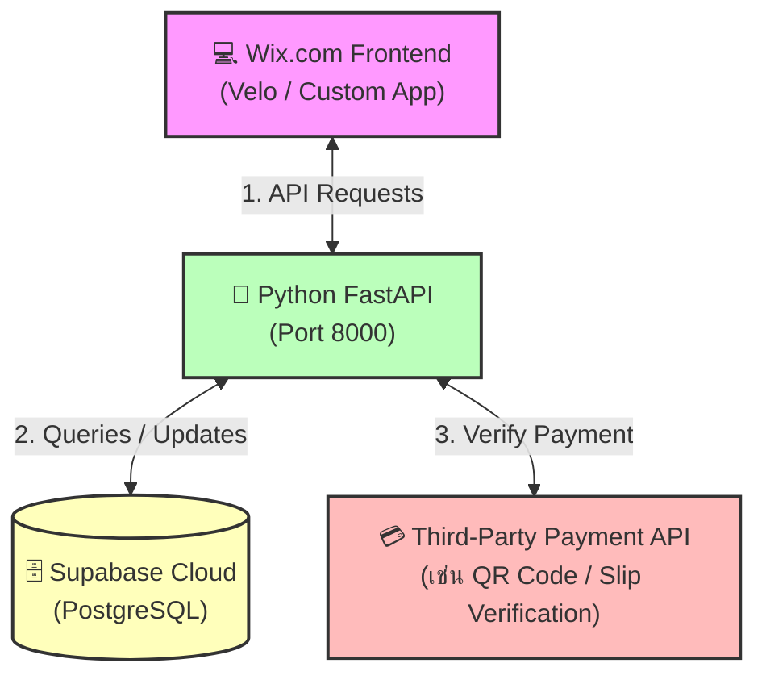

# 📑 Project Specification Template (เอกสารกลางสำหรับข้อตกลงโครงการ)

เอกสารฉบับนี้ใช้เป็น **"เอกสารกลาง"** เพื่อบันทึกข้อตกลงร่วมกันระหว่างทีมพัฒนาในการออกแบบระบบและสถาปัตยกรรมของโครงการ **ALM-X-IMPACT Tennis** เพื่อใช้ตรวจสอบความถูกต้องและลดความสับสนในการทำงานร่วมกัน

---

## 🛠️ หัวข้อที่ 1: Tech Stack Selection (การเลือกเทคโนโลยี)

ตารางสรุปเทคโนโลยีพื้นฐานและข้อกำหนดเวอร์ชันสำหรับโครงการ **ALM-X-IMPACT Tennis** (ปรับปรุงให้ตรงกับสภาพแวดล้อมจริงในเครื่องพัฒนาของท่าน)

### 💻 1. Frontend Integration (Wix.com)
ทีมพัฒนาฝั่งหน้าบ้านเปลี่ยนมาใช้งานระบบ **Wix.com** โดยทำการเชื่อมต่อกับระบบหลังบ้านผ่านทาง REST API เพื่อประมวลผลข้อมูลและใช้บริการต่าง ๆ เช่น ระบบสมาชิก การจองคิวสนาม และการหาคู่เล่น

---

### 🐍 2. Backend Tech Stack & Versions
ทีมพัฒนาฝั่งหลังบ้านจะใช้ภาษา Python ร่วมกับ FastAPI และเครื่องมือช่วยจัดการฐานข้อมูล/ความปลอดภัย ดังนี้:

*   **Language Runtime:** Python `v3.11.9` *(ตรงตามเวอร์ชันในเครื่องของท่าน)*
*   **Web Framework:** FastAPI `v0.115.6` *(เวอร์ชันเสถียรล่าสุด รองรับ Asynchronous และสร้างคู่มือ Swagger Docs ให้อัตโนมัติ)*
*   **ASGI Server:** Uvicorn `v0.34.0` *(เวอร์ชันล่าสุดสำหรับรัน Web Server ประสิทธิภาพสูง)*
*   **Database ORM (Async):** SQLAlchemy `v2.0+` *(Object Relational Mapper สำหรับ PostgreSQL ทำงานร่วมกับ Pydantic v2 แบบ Async อย่างเสถียร)*
*   **Database Driver:** asyncpg `v0.29+` *(Async PostgreSQL Driver สำหรับ Python เวอร์ชันล่าสุด)*
*   **Data Validation:** Pydantic `v2.10.3` *(เวอร์ชันล่าสุด ปลอดภัย และทำงานเร็วกว่า Pydantic v1 ถึง 10 เท่า)*
*   **Auth & JWT:** PyJWT `v2.10.1` *(สร้างและตรวจสอบ JWT Token เวอร์ชันอัปเดตล่าสุด)*
*   **Security & Password Hashing:** `pwdlib[bcrypt] v0.2.1` *(🔥 ใช้แทน passlib เพื่อตัดปัญหาการชนกันกับ bcrypt บน Python 3.11+ อย่างถาวร)*
*   **File Upload Support:** python-multipart `v0.0.19` *(จำเป็นสำหรับการรับอัปโหลดภาพสลิปชำระเงินโอนเงิน)*
*   **Environment Management:** python-dotenv `v1.0.1` *(โหลดตัวแปรคอนฟิกจากไฟล์ `.env`)*

---

### 🗄️ 3. Database & Tools
*   **Database Engine:** Supabase Cloud (PostgreSQL `v15`) (ฐานข้อมูล Relational บน Cloud ของทางบริษัท รองรับ Schema ที่ยืดหยุ่นสูงผ่าน JSONB Columns)
*   **GUI Client:** Supabase Dashboard (สำหรับช่วยตรวจสอบข้อมูลในฐานข้อมูลผ่านหน้าเว็บ Supabase)

---

### ⚠️ 4. ข้อควรระวังและการป้องกันบั๊ก/เออเรอร์ฝั่งหลังบ้าน (Error Prevention)

เพื่อป้องกันการเกิดเออเรอร์ระหว่างรันโปรแกรมฝั่งหลังบ้าน (Backend) ในสภาพแวดล้อม Python 3.11+ ขอให้ปฏิบัติงานตามแนวทางแก้ไขเหล่านี้:

> [!WARNING]
> **Python 3.11+: ปัญหา bcrypt ใน passlib (แนะนำใช้ pwdlib)**
> ไลบรารี `passlib` เดิมไม่มีการอัปเดตมานาน เมื่อนำมารันร่วมกับไลบรารี `bcrypt` เวอร์ชันใหม่บน Python 3.11+ จะเกิดเออเรอร์ `TypeError: 'NoneType' object is not callable` หรือ `AttributeError` ตอนรันคำสั่งแฮชรหัสผ่าน
> *   **ทางเลือกที่ถูกต้อง:** FastAPI ยุคปัจจุบันเปลี่ยนคำแนะนำอย่างเป็นทางการมาให้ใช้ **`pwdlib[bcrypt]`** ร่วมกับไลบรารี `bcrypt` โดยตรง ซึ่งเสถียรและทำงานร่วมกับ Python 3.11/3.12 ได้แบบ 100% ปราศจากข้อผิดพลาด

---

## 📊 หัวข้อที่ 2: System Architecture Diagram (แผนผังระบบ)

แผนผังแสดงสถาปัตยกรรมของระบบและการไหลของข้อมูล (Data Flow) พร้อมทั้งกำหนด Port ในการพัฒนาบนเครื่อง Local Machine

### 💻 Local Development Ports
*   **Frontend:** เชื่อมต่อผ่าน API จาก Wix.com
*   **Backend (Python/FastAPI):** `http://localhost:8000`
*   **Database (Supabase Cloud):** เชื่อมต่อผ่าน `SUPABASE_DB_URL` ในไฟล์ `.env`

### 🔄 Data Flow & System Diagram


---

## 🌿 หัวข้อที่ 3: Git Workflow & Repository Structure

ข้อตกลงร่วมกันในการบริหารจัดการซอร์สโค้ดผ่านระบบ Git บน GitHub Organization

### 📁 1. Repository Strategy: Backend & Docs Workspace
โครงการนี้ใช้โครงสร้างโฟลเดอร์สำหรับเก็บโค้ดส่วนของระบบหลังบ้านและเอกสารของระบบทั้งหมด:

```text
ALM-X-IMPACT-Tennis/ (Root)
├── docs/                 # เอกสารกลางและข้อกำหนดต่าง ๆ (เช่น project_specification.md)
├── backend/              # ซอร์สโค้ดส่วนหลังบ้าน (Python FastAPI เชื่อมกับ Wix.com)
└── database/             # สคริปต์การตั้งค่า Schema, Seed Data หรือ Migration
```

### 🎋 2. Branch Naming Convention (กฎการตั้งชื่อกิ่ง)
เพื่อรักษาระเบียบในการทำงานและการทำ CI/CD ให้กำหนดโครงสร้างชื่อ Branch ดังนี้:

*   `main` (หรือ `master`): กิ่งหลักสำหรับขึ้นโปรดักชัน (Production Only) ห้าม Push โค้ดตรง ๆ โดยเด็ดขาด
*   `develop`: กิ่งรวมงานสำหรับการทดสอบเบื้องต้น (Staging/Testing environment)
*   `feature/<ticket-id>-<description>`: กิ่งสำหรับการพัฒนาฟีเจอร์ใหม่
    *   *ตัวอย่าง:* `feature/booking-system`, `feature/user-login`
*   `bugfix/<ticket-id>-<description>`: กิ่งสำหรับแก้ไขบั๊กทั่วไปที่พบจากการทดสอบ
    *   *ตัวอย่าง:* `bugfix/fix-matching-timeout`
*   `hotfix/<description>`: กิ่งด่วนสำหรับแก้บั๊กเร่งด่วนบน Production
    *   *ตัวอย่าง:* `hotfix/payment-gateway-crash`

### ✍️ 3. Git Commit Message Guide (Conventional Commits)
แนะนำให้เขียน Commit Message ให้เข้าใจง่ายตามมาตรฐาน เช่น:
*   `feat: add queue booking page` (เพิ่มฟีเจอร์ใหม่)
*   `fix: resolve payment slip upload error` (แก้ไขข้อผิดพลาด)
*   `docs: update project specification template` (แก้ไขเอกสาร)

---

## 🗃️ หัวข้อที่ 4: Database Schema Rough Draft (ร่างตารางฐานข้อมูลคร่าวๆ)

ระบบจองคิวสนามเทนนิสและระบบจับคู่ใช้งาน **Supabase Cloud PostgreSQL** ซึ่งเป็นแบบ Relational Tables ด้านล่างนี้คือแบบร่างโครงสร้างของตาราง (Tables) หลักที่ปรับปรุงให้สอดรับกับฟีเจอร์ใน `core feature.md` แล้ว (ใช้ JSONB Columns สำหรับข้อมูลแบบยืดหยุ่น)

### 👥 1. Users Table (`alm_users`)
```sql
-- Table: alm_users
id             TEXT PRIMARY KEY,  -- UUID
username       TEXT NOT NULL,
email          TEXT UNIQUE NOT NULL,
password_hash  TEXT,               -- ค่าว่างได้หากสมัครผ่าน Google Auth
google_id      TEXT,               -- เก็บ ID จาก Google SSO
role           TEXT DEFAULT 'player',  -- "player", "admin", "court_owner"
profile        JSONB NOT NULL,     -- เก็บข้อมูลโปรไฟล์ยืดหยุ่นแบบ JSON
-- profile JSONB ประกอบด้วย:
--   display_name, phone, is_phone_verified, ntrp_rating, wtn_rating,
--   playing_style, match_preference
created_at     TIMESTAMPTZ DEFAULT NOW()
```

### 🎾 2. Courts Table (`alm_courts`)
```sql
-- Table: alm_courts
id              TEXT PRIMARY KEY,  -- UUID
court_name      TEXT NOT NULL,
location        TEXT NOT NULL,
price_per_hour  FLOAT NOT NULL,
available_slots JSONB NOT NULL     -- [{"time_slot": "17:00-18:00", "is_booked": false}]
```

### 📅 3. Bookings Table (`alm_bookings`)
```sql
-- Table: alm_bookings
id            TEXT PRIMARY KEY,  -- UUID
user_id       TEXT NOT NULL,     -- Reference to alm_users
court_id      TEXT NOT NULL,     -- Reference to alm_courts
booking_date  TEXT NOT NULL,     -- YYYY-MM-DD
time_slot     TEXT NOT NULL,     -- "18:00-19:00"
status        TEXT DEFAULT 'pending',  -- "pending", "confirmed", "cancelled"
payment_id    TEXT,              -- Reference to alm_transactions
created_at    TIMESTAMPTZ DEFAULT NOW()
```

### 🤝 4. Matches Table (`alm_matches`)
```sql
-- Table: alm_matches
id               TEXT PRIMARY KEY,  -- UUID
host_user_id     TEXT NOT NULL,     -- ผู้สร้างโพสต์หาคู่เล่น
invited_user_ids JSONB DEFAULT '[]', -- ผู้ที่เข้ามาร่วมเล่นด้วย (Array รองรับประเภทคู่)
court_id         TEXT NOT NULL,
match_date       TEXT NOT NULL,     -- YYYY-MM-DD
time_slot        TEXT NOT NULL,     -- "18:00-20:00"
match_type       TEXT DEFAULT 'singles',  -- "singles" / "doubles"
ntrp_min         FLOAT DEFAULT 1.5,      -- เกณฑ์ฝีมือขั้นต่ำที่เปิดรับ
ntrp_max         FLOAT DEFAULT 7.0,      -- เกณฑ์ฝีมือสูงสุดที่เปิดรับ
status           TEXT DEFAULT 'open',    -- "open", "matched", "cancelled"
created_at       TIMESTAMPTZ DEFAULT NOW()
```

### 💬 5. Reviews Table (`alm_reviews`)
```sql
-- Table: alm_reviews
id           TEXT PRIMARY KEY,  -- UUID
reviewer_id  TEXT NOT NULL,     -- ผู้เขียนรีวิว (Reference to alm_users)
reviewee_id  TEXT NOT NULL,     -- ผู้ที่ถูกรีวิว (Reference to alm_users)
match_id     TEXT NOT NULL,     -- รีวิวที่เกิดจากแมตช์การเล่นใด (Reference to alm_matches)
rating       INTEGER DEFAULT 5, -- คะแนนเรตติ้ง (1 - 5 ดาว)
comment      TEXT NOT NULL,     -- ความคิดเห็นเพิ่มเติม
created_at   TIMESTAMPTZ DEFAULT NOW()
```

### 💳 6. Transactions Table (`alm_transactions`)
```sql
-- Table: alm_transactions
id              TEXT PRIMARY KEY,  -- UUID
user_id         TEXT NOT NULL,
booking_id      TEXT NOT NULL,
amount          FLOAT NOT NULL,
payment_method  TEXT NOT NULL,     -- "PromptPay", "BankTransfer"
slip_url        TEXT NOT NULL,     -- ที่อยู่ไฟล์ภาพสลิปบน Cloud
status          TEXT DEFAULT 'pending',  -- "pending", "verified", "failed"
created_at      TIMESTAMPTZ DEFAULT NOW(),
verified_at     TIMESTAMPTZ
```

### 🔗 ความสัมพันธ์เบื้องต้น (Relationships)
1.  **User กับ Booking (One-to-Many):** User 1 คน สามารถจองคิวสนามได้หลายครั้ง (`user_id` ในตาราง alm_bookings)
2.  **User กับ Match (One-to-Many / Many-to-Many):** User 1 คนสามารถเป็น Host สร้าง Match ได้หลายอัน และเข้าร่วม Match ของคนอื่นได้หลายอัน
3.  **Booking กับ Transaction (One-to-One):** การจองคิว 1 รายการ จะสัมพันธ์กับการโอนชำระเงิน 1 รายการเสมอ
4.  **Match กับ Review (One-to-Many):** แมตช์ 1 แมตช์เมื่อสิ้นสุดการเล่นจะสามารถเกิดการรีวิวผู้เล่นที่ร่วมแมตช์ได้หลายรีวิว (UGC)

---

## 🔌 หัวข้อที่ 5: API Endpoints Contract (สัญญาข้อตกลง API)

สัญญาการเชื่อมต่อเพื่อประสิทธิภาพในการทำงานร่วมกันระหว่างหน้าบ้าน (Wix.com) และหลังบ้าน (FastAPI) โดยเพิ่มการรองรับ Google Login, SMS OTP, และการส่งรีวิว UGC ตามโฟลว์จริง

### 🔐 1. Authentication (ระบบสมาชิกและความปลอดภัย)

#### `POST /api/v1/auth/login`
*   **คำอธิบาย:** สำหรับการเข้าสู่ระบบแบบเดิมด้วยอีเมล
*   **Request Body:**
    ```json
    {
      "email": "user@example.com",
      "password": "securepassword123"
    }
    ```

#### `POST /api/v1/auth/google`
*   **คำอธิบาย:** สำหรับการเข้าสู่ระบบด้วย Google Account (SSO)
*   **Request Body:**
    ```json
    {
      "id_token": "google_oauth_jwt_token_string"
    }
    ```
*   **Response (200 OK):**
    ```json
    {
      "access_token": "jwt_token_here",
      "token_type": "bearer",
      "user": {
        "id": "60d5ec4b2f8fb8123456789a",
        "username": "tennis_player_sso",
        "email": "user@gmail.com",
        "role": "player",
        "is_phone_verified": false
      }
    }
    ```

#### `POST /api/v1/auth/otp/send`
*   **คำอธิบาย:** ขอส่งรหัส OTP ยืนยันเบอร์โทรศัพท์มือถือผ่าน SMS
*   **Request Body:**
    ```json
    {
      "phone": "0812345678"
    }
    ```
*   **Response (200 OK):**
    ```json
    {
      "message": "OTP sent successfully to 0812345678",
      "ref_code": "XYZA"
    }
    ```

#### `POST /api/v1/auth/otp/verify`
*   **คำอธิบาย:** ยืนยันรหัส OTP จากโทรศัพท์มือถือเพื่อบันทึกสถานะในฐานข้อมูล
*   **Request Body:**
    ```json
    {
      "phone": "0812345678",
      "otp_code": "123456",
      "ref_code": "XYZA"
    }
    ```
*   **Response (200 OK):**
    ```json
    {
      "status": "success",
      "message": "Phone number verified successfully"
    }
    ```

---

### 📅 2. Queue & Booking (ระบบจองคิวสนาม)

#### `GET /api/v1/queues`
*   **คำอธิบาย:** ดึงรายการคิวการจองของตนเอง หรือรายการจองทั้งหมด (สำหรับ Admin)
*   **Response (200 OK):**
    ```json
    [
      {
        "booking_id": "60d5ec4b2f8fb8123456789b",
        "court_name": "Impact Court A",
        "booking_date": "2026-05-25",
        "time_slot": "18:00-20:00",
        "status": "confirmed"
      }
    ]
    ```

#### `POST /api/v1/queues/book`
*   **คำอธิบาย:** การส่งคำขอจองคิวสนาม
*   **Request Body:**
    ```json
    {
      "court_id": "60d5ec4b2f8fb8123456789c",
      "booking_date": "2026-05-25",
      "time_slot": "18:00-20:00"
    }
    ```
*   **Response (201 Created):**
    ```json
    {
      "message": "Booking request created successfully",
      "booking_id": "60d5ec4b2f8fb8123456789b",
      "status": "pending_payment"
    }
    ```

---

### 🤝 3. Matchmaking & Filtering (ระบบหาคู่เล่น/จับคู่ตามระดับความเก่ง)

#### `POST /api/v1/matching/find`
*   **คำอธิบาย:** ใช้ค้นหาผู้เล่นหรือเปิดโพสต์ห้องหาคู่เล่น โดยคัดกรองระดับ NTRP และสเปกความชอบโดยละเอียด
*   **Request Body:**
    ```json
    {
      "court_id": "60d5ec4b2f8fb8123456789c",
      "match_date": "2026-05-25",
      "time_slot": "18:00-20:00",
      "match_type": "singles", // "singles" / "doubles"
      "ntrp_min": 2.5, // กรองระดับ NTRP ขั้นต่ำ
      "ntrp_max": 4.0, // กรองระดับ NTRP สูงสุด
      "preferred_playing_style": "All-Court" // ออปชันกรองสไตล์การเล่น
    }
    ```
*   **Response (200 OK):**
    ```json
    {
      "match_id": "60d5ec4b2f8fb8123456789d",
      "status": "open",
      "host": {
        "username": "tennis_lover",
        "ntrp": 3.0,
        "playing_style": "Aggressive Baseliner"
      },
      "compatible_matches": [
        {
          "user_id": "60d5ec4b2f8fb8123456789z",
          "username": "net_rusher",
          "ntrp": 3.5
        }
      ]
    }
    ```

---

### 💬 4. Player Reviews & UGC (การรีวิวหลังแมตช์)

#### `POST /api/v1/matches/{id}/reviews`
*   **คำอธิบาย:** ผู้เล่นส่งคำติชมรีวิวหลังเกมให้กับเพื่อนร่วมเล่นเพื่อเพิ่มคะแนนเรตติ้งในสังคม (UGC Loop)
*   **Request Body:**
    ```json
    {
      "reviewee_id": "60d5ec4b2f8fb8123456789z", // รหัสผู้ใช้ที่จะรีวิวให้
      "rating": 5, // 1-5 ดาว
      "comment": "เล่นสนุกมาก คุมหน้าเน็ตได้ดี สุภาพมาก"
    }
    ```
*   **Response (201 Created):**
    ```json
    {
      "status": "success",
      "message": "Review submitted successfully",
      "review_id": "60d5ec4b2f8fb8123456789r"
    }
    ```

---

### 💳 5. Payments (ระบบชำระเงินและโอน)

#### `POST /api/v1/payments/pay`
*   **คำอธิบาย:** ส่งหลักฐานการโอนชำระเงินคิวสนาม
*   **Request Body (Multipart Form Data):**
    *   `booking_id`: "60d5ec4b2f8fb8123456789b"
    *   `amount`: 500.00
    *   `slip_file`: [Binary Image File]
*   **Response (200 OK):**
    ```json
    {
      "transaction_id": "60d5ec4b2f8fb8123456789e",
      "status": "processing",
      "message": "Payment slip uploaded, waiting for verification"
    }
    ```

---

### 🔍 6. General Data (ดึงข้อมูลทั่วไป)

#### `GET /api/v1/data`
*   **คำอธิบาย:** ดึงข้อมูลสถิติทั่วไปหรือการตั้งค่าหลักของระบบมาแสดงที่ Dashboard หน้าบ้าน
*   **Response (200 OK):**
    ```json
    {
      "total_active_users": 152,
      "available_courts_today": 8,
      "upcoming_matches_count": 14,
      "system_announcement": "ยินดีต้อนรับสู่สนาม Impact Tennis! มีโปรโมชั่นช่วงบ่ายลด 20%"
    }
    ```

---

## 🚀 หัวข้อที่ 6: Future Project Roadmap (แผนงานและทิศทางการพัฒนา)

เพื่อรองรับการขยายตัวทางเทคนิคและสถาปัตยกรรม การพัฒนาและการออกแบบระบบจะถูกแบ่งลำดับความสำคัญตามแผนการดำเนินงาน (Phasing) ที่ปรับเปลี่ยนใหม่ ดังนี้:

### 🏆 Phase 1 - Core Court Booking & Player Matchmaking MVP (เฟสปัจจุบัน)
เป้าหมายหลักคือเปิดระบบจองคิวสนามเทนนิส พร้อมระบบค้นหาคู่เล่นเทนนิสและระบบสมาชิกเบื้องต้น
*   **ระบบจองคิวสนามเทนนิสแบบระบุวันและเวลา** (Slot booking)
*   **ระบบยืนยันตัวตนด้วยเบอร์โทรศัพท์ SMS OTP** (เพื่อระบุและยืนยันตัวตนผู้ใช้จริง)
*   **ระบบส่งภาพและตรวจสลิปโอนเงินแบบแมนนวล** (Manual Slip Verification)
*   **ระบบลงทะเบียนสมัครสมาชิกด้วยบัญชี Google** (Google SSO Login)
*   **ระบบค้นหาคู่เล่นตามระดับความเก่ง NTRP** (Core Matching Algorithm 1.5 - 7.0)
*   **ระบบเขียนรีวิวประเมินผู้เล่นหลังแมตช์** (User UGC Reviews)

### 🥈 Phase 2 - Membership & Coach Booking System (เฟสถัดไป)
เน้นการขยายขีดความสามารถการบริการและการบริหารจัดการสมาชิกอย่างเป็นระบบ
*   **ระบบค้นหาและจองคิวโค้ชผู้ฝึกสอนในสนาม** (Coach Booking System)
*   **ระบบจัดระดับชั้นสมาชิกและสิทธิพิเศษ** (Member Tier / Privilege System)
*   **ระบบการคำนวณและลดหย่อนราคาพิเศษรายสมาชิก** (Member Pricing Logic)
*   **ระบบสถิติการเล่นและรายงานกิจกรรมผู้ใช้** (User Activity & Performance Reports)

### 🛍️ Phase 3 - Marketplace & Service Explanation
ขยายระบบให้ครอบคลุมการซื้อขายเชิงพาณิชย์อิเล็กทรอนิกส์และบริการทางดิจิทัลในสนาม
*   **ระบบร้านค้าขายสินค้าและบริการ** (Storefront/Merchandise: น้ำดื่ม, ลูกเทนนิส, ไม้เช่า)
*   **ระบบแลกบัตรกำนัลและคูปอง** (Voucher Redeem System)
*   **ระบบตลาดบริการดิจิทัลระดับสูง** (Service Marketplace เช่น การเช่าคู่ซ้อมระดับมือโปร Knocker/Hitting partner)

---

> 📝 **คำแนะนำสำหรับพัฒนาต่อ:** 
> หลังจากที่สมาชิกทีมตกลงรายละเอียดและปรับปรุงตัวแปรต่าง ๆ เรียบร้อยแล้ว ให้ทำการอัปเดตไฟล์นี้ทันทีเพื่อรักษาสัญญาการออกแบบ API (API Contract) และฐานข้อมูลให้สอดคล้องกันเสมอ

